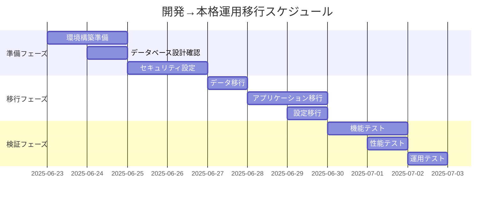

# 移行計画

## 1. 概要

### 1.1 目的
FastMCPスターターキットプロジェクトにおける様々な移行シナリオに対応する包括的な移行計画を定義します。初学者が安全かつ効率的にシステム移行を実現できるよう支援します。

### 1.2 移行対象シナリオ
1. **開発環境 → 本格運用環境**
2. **他MCPフレームワーク → FastMCP**
3. **学習環境 → 実プロジェクト環境**
4. **バージョンアップ移行**
5. **データセンター間移行**

### 1.3 移行原則
```yaml
移行基本方針:
  無停止移行: 可能な限りダウンタイムを最小化
  データ保護: 学習進捗・設定データの完全保護
  段階的移行: リスクを最小化するフェーズ分割
  ロールバック対応: 問題発生時の迅速な元環境復旧
  検証重視: 各段階での動作確認・性能検証
```

## 2. 開発環境→本格運用環境移行

### 2.1 移行計画


### 2.2 移行スクリプト
```bash
#!/bin/bash
# dev_to_production_migration.sh

# 設定
DEV_DB="fastmcp_dev.db"
PROD_DB="fastmcp_prod.db"
DEV_CONFIG="config/development"
PROD_CONFIG="config/production"

migrate_to_production() {
    echo "🚀 本格運用環境への移行開始"
    
    # 1. 前提条件チェック
    echo "📋 前提条件チェック中..."
    check_prerequisites_production || exit 1
    
    # 2. 本格運用環境準備
    echo "🏗️  本格運用環境準備中..."
    setup_production_environment
    
    # 3. データベース移行
    echo "📊 データベース移行中..."
    migrate_database_to_production
    
    # 4. 設定ファイル移行
    echo "⚙️  設定ファイル移行中..."
    migrate_configuration_to_production
    
    # 5. セキュリティ強化
    echo "🔒 セキュリティ設定強化中..."
    enhance_production_security
    
    # 6. 本格運用環境テスト
    echo "🧪 本格運用環境テスト中..."
    test_production_environment
    
    echo "✅ 本格運用環境移行完了"
}

# データベース移行
migrate_database_to_production() {
    # 開発環境データのクリーンアップ
    echo "🧹 開発データクリーンアップ中..."
    sqlite3 "$DEV_DB" "
        DELETE FROM user_progress WHERE created_at < date('now', '-30 days');
        DELETE FROM logs WHERE timestamp < datetime('now', '-7 days');
        VACUUM;
    "
    
    # 本格運用向けデータ最適化
    echo "🔧 本格運用向け最適化中..."
    sqlite3 "$DEV_DB" "
        -- インデックス再構築
        REINDEX;
        
        -- 統計情報更新
        ANALYZE;
        
        -- 本格運用設定の適用
        UPDATE settings SET 
            debug_mode = 0,
            log_level = 'INFO',
            cache_size = 1000
        WHERE category = 'system';
    "
    
    # データベースコピー
    cp "$DEV_DB" "$PROD_DB"
    
    # 本格運用固有設定
    sqlite3 "$PROD_DB" "
        INSERT OR REPLACE INTO settings (category, key, value) VALUES
            ('environment', 'mode', 'production'),
            ('security', 'session_timeout', '3600'),
            ('performance', 'max_connections', '100');
    "
}

# 設定移行
migrate_configuration_to_production() {
    # 本格運用設定ファイル生成
    cat > "$PROD_CONFIG/config.toml" << EOF
[server]
host = "0.0.0.0"
port = 8000
debug = false
log_level = "INFO"

[database]
url = "fastmcp_prod.db"
pool_size = 10
timeout = 30

[security]
session_timeout = 3600
rate_limiting = true
ssl_enabled = true

[transport]
supported_modes = ["sse", "stdio"]
default_mode = "sse"
sse_cors_enabled = false

[learning]
max_concurrent_sessions = 50
session_timeout = 1800
progress_save_interval = 300
EOF

    # SSL証明書設定
    if [ -f "certificates/server.crt" ]; then
        echo "🔐 SSL証明書設定中..."
        cp certificates/* "$PROD_CONFIG/certificates/"
    fi
}

# セキュリティ強化
enhance_production_security() {
    # ファイル権限設定
    chmod 600 "$PROD_CONFIG/config.toml"
    chmod 600 "$PROD_DB"
    
    # ユーザー・グループ設定
    chown fastmcp:fastmcp "$PROD_CONFIG"/* "$PROD_DB"
    
    # ファイアウォール設定
    ufw allow 8000/tcp
    ufw enable
    
    # システムハードニング
    echo "net.ipv4.ip_forward=0" >> /etc/sysctl.conf
    echo "net.ipv4.conf.all.send_redirects=0" >> /etc/sysctl.conf
    sysctl -p
}

## 3. 他フレームワーク→FastMCP移行

### 3.1 移行対応表
```yaml
移行元フレームワーク別対応:

Python MCP SDK:
  互換性: 高
  主要変更点:
    - サーバー初期化方法の変更
    - ツール登録の簡略化
    - 非同期処理の最適化
  移行工数: 1-2日

Node.js MCP:
  互換性: 中
  主要変更点:
    - 言語変更 (JavaScript → Python)
    - ツール定義の書き直し
    - データベース接続の変更
  移行工数: 3-5日

カスタムMCP実装:
  互換性: 低
  主要変更点:
    - 全面的な書き直し
    - プロトコル実装の置き換え
    - データ形式の変換
  移行工数: 1-2週間
```

### 3.2 フレームワーク移行ツール
```python
# framework_migration_tool.py
import json
import sqlite3
import re
from pathlib import Path
from typing import Dict, List

class FrameworkMigrator:
    """フレームワーク移行支援ツール"""
    
    def __init__(self, source_framework: str):
        self.source_framework = source_framework
        self.migration_rules = self.load_migration_rules()
    
    def migrate_from_python_mcp_sdk(self, source_dir: str, target_dir: str):
        """Python MCP SDKからの移行"""
        print("🔄 Python MCP SDK → FastMCP 移行開始")
        
        # 1. ツール定義の移行
        tools = self.extract_tools_from_python_mcp(source_dir)
        self.generate_fastmcp_tools(tools, target_dir)
        
        # 2. リソース定義の移行
        resources = self.extract_resources_from_python_mcp(source_dir)
        self.generate_fastmcp_resources(resources, target_dir)
        
        # 3. サーバー設定の移行
        server_config = self.extract_server_config_python_mcp(source_dir)
        self.generate_fastmcp_server(server_config, target_dir)
        
        print("✅ Python MCP SDK 移行完了")
    
    def extract_tools_from_python_mcp(self, source_dir: str) -> List[Dict]:
        """Python MCP SDKからツール定義を抽出"""
        tools = []
        
        for py_file in Path(source_dir).glob("**/*.py"):
            content = py_file.read_text()
            
            # @tool デコレータの検出
            tool_matches = re.finditer(
                r'@tool\s*\n\s*def\s+(\w+)\s*\([^)]*\):\s*\n\s*"""([^"]+)"""',
                content, re.MULTILINE | re.DOTALL
            )
            
            for match in tool_matches:
                tool_name = match.group(1)
                tool_description = match.group(2).strip()
                
                # 関数定義の抽出
                func_def = self.extract_function_definition(content, tool_name)
                
                tools.append({
                    "name": tool_name,
                    "description": tool_description,
                    "function": func_def,
                    "source_file": str(py_file)
                })
        
        return tools
    
    def generate_fastmcp_tools(self, tools: List[Dict], target_dir: str):
        """FastMCP形式のツール生成"""
        tools_file = Path(target_dir) / "tools.py"
        
        code = '''"""FastMCP Tools - Migrated from Python MCP SDK"""
from fastmcp import FastMCP

app = FastMCP("Migrated MCP Server")

'''
        
        for tool in tools:
            # FastMCP形式に変換
            fastmcp_tool = f'''
@app.tool()
def {tool["name"]}({self.extract_parameters(tool["function"])}):
    """{tool["description"]}"""
{self.convert_function_body(tool["function"])}

'''
            code += fastmcp_tool
        
        tools_file.write_text(code)
    
    def migrate_from_nodejs_mcp(self, source_dir: str, target_dir: str):
        """Node.js MCPからの移行"""
        print("🔄 Node.js MCP → FastMCP 移行開始")
        
        # JavaScript/TypeScriptファイルの解析
        js_files = list(Path(source_dir).glob("**/*.js")) + list(Path(source_dir).glob("**/*.ts"))
        
        migration_report = {
            "tools_migrated": 0,
            "resources_migrated": 0,
            "manual_review_needed": []
        }
        
        for js_file in js_files:
            content = js_file.read_text()
            
            # ツール登録の検出
            tool_registrations = re.finditer(
                r'server\.setRequestHandler\s*\(\s*ListToolsRequestSchema\s*,\s*async\s*\([^)]*\)\s*=>\s*\{([^}]+)\}',
                content, re.MULTILINE | re.DOTALL
            )
            
            for match in tool_registrations:
                # 手動レビューが必要な項目として記録
                migration_report["manual_review_needed"].append({
                    "file": str(js_file),
                    "type": "tool_registration",
                    "content": match.group(0)[:200] + "..."
                })
        
        # 移行レポート生成
        self.generate_migration_report(migration_report, target_dir)
        
        print("✅ Node.js MCP 移行完了（手動レビューが必要な項目があります）")
    
    def generate_migration_template(self, target_dir: str):
        """移行テンプレート生成"""
        template_dir = Path(target_dir) / "migration_template"
        template_dir.mkdir(exist_ok=True)
        
        # メインサーバーファイル
        (template_dir / "main.py").write_text('''
"""FastMCP Server - Migration Template"""
from fastmcp import FastMCP
import asyncio

app = FastMCP("Migrated MCP Server")

# TODO: 移行したツールをここに追加
# from tools import *

# TODO: 移行したリソースをここに追加
# from resources import *

if __name__ == "__main__":
    # SSE/STDIO両方対応
    import sys
    if "--transport" in sys.argv:
        transport_idx = sys.argv.index("--transport")
        transport = sys.argv[transport_idx + 1] if len(sys.argv) > transport_idx + 1 else "stdio"
    else:
        transport = "stdio"
    
    if transport == "sse":
        app.run(transport="sse", port=8000)
    else:
        app.run(transport="stdio")
''')
        
        # 移行チェックリスト
        (template_dir / "MIGRATION_CHECKLIST.md").write_text('''
# 移行チェックリスト

## 必須作業
- [ ] ツール定義の移行確認
- [ ] リソース定義の移行確認
- [ ] エラーハンドリングの実装
- [ ] テストケースの作成

## 推奨作業
- [ ] ログ設定の最適化
- [ ] パフォーマンス測定
- [ ] セキュリティチェック
- [ ] ドキュメント更新

## 検証項目
- [ ] 基本機能動作確認
- [ ] SSE/STDIO両方の動作確認
- [ ] エラー処理の確認
- [ ] 性能要件の確認
''')
```

## 4. バージョンアップ移行

### 4.1 バージョンアップ戦略
```python
# version_migration.py
from packaging import version
import sqlite3
import json
from pathlib import Path

class VersionMigrator:
    """バージョンアップ移行管理"""
    
    def __init__(self, current_version: str, target_version: str):
        self.current_version = version.parse(current_version)
        self.target_version = version.parse(target_version)
        self.migration_scripts = self.load_migration_scripts()
    
    def plan_migration(self) -> Dict:
        """移行計画の策定"""
        migration_plan = {
            "current_version": str(self.current_version),
            "target_version": str(self.target_version),
            "required_steps": [],
            "risks": [],
            "rollback_plan": {},
            "estimated_downtime": 0
        }
        
        # 必要な移行ステップを特定
        for script_version, script in self.migration_scripts.items():
            if self.current_version < version.parse(script_version) <= self.target_version:
                migration_plan["required_steps"].append({
                    "version": script_version,
                    "description": script["description"],
                    "breaking_changes": script.get("breaking_changes", []),
                    "estimated_time": script.get("estimated_time", 5)
                })
                migration_plan["estimated_downtime"] += script.get("estimated_time", 5)
        
        # リスク評価
        migration_plan["risks"] = self.assess_migration_risks()
        
        return migration_plan
    
    def execute_migration(self) -> bool:
        """バージョンアップ移行の実行"""
        try:
            # 1. 現在の状態バックアップ
            self.create_pre_migration_backup()
            
            # 2. 段階的移行実行
            for step in self.plan_migration()["required_steps"]:
                print(f"🔄 {step['version']} への移行実行中...")
                
                success = self.execute_migration_step(step["version"])
                if not success:
                    print(f"❌ {step['version']} 移行失敗 - ロールバック実行中...")
                    self.rollback_migration()
                    return False
                
                print(f"✅ {step['version']} 移行完了")
            
            # 3. 移行後検証
            if self.verify_migration():
                print("✅ バージョンアップ移行完了")
                return True
            else:
                print("❌ 移行後検証失敗 - ロールバック実行中...")
                self.rollback_migration()
                return False
                
        except Exception as e:
            print(f"❌ 移行中にエラー発生: {e} - ロールバック実行中...")
            self.rollback_migration()
            return False
    
    def execute_migration_step(self, target_version: str) -> bool:
        """個別移行ステップの実行"""
        script = self.migration_scripts.get(target_version)
        if not script:
            return False
        
        try:
            # データベーススキーマ更新
            if "database_migrations" in script:
                self.execute_database_migrations(script["database_migrations"])
            
            # 設定ファイル更新
            if "config_updates" in script:
                self.execute_config_updates(script["config_updates"])
            
            # カスタムスクリプト実行
            if "custom_script" in script:
                self.execute_custom_script(script["custom_script"])
            
            # バージョン情報更新
            self.update_version_info(target_version)
            
            return True
            
        except Exception as e:
            print(f"Migration step error: {e}")
            return False
    
    def execute_database_migrations(self, migrations: List[str]):
        """データベース移行の実行"""
        conn = sqlite3.connect("fastmcp.db")
        cursor = conn.cursor()
        
        for migration_sql in migrations:
            cursor.execute(migration_sql)
        
        conn.commit()
        conn.close()
    
    def load_migration_scripts(self) -> Dict:
        """移行スクリプトの読み込み"""
        return {
            "1.1.0": {
                "description": "学習システム強化",
                "database_migrations": [
                    "ALTER TABLE user_progress ADD COLUMN completion_score INTEGER DEFAULT 0;",
                    "CREATE INDEX idx_user_progress_score ON user_progress(completion_score);"
                ],
                "config_updates": {
                    "learning.scoring_enabled": True,
                    "learning.max_score": 100
                },
                "estimated_time": 3
            },
            "1.2.0": {
                "description": "SSE/STDIO最適化",
                "breaking_changes": [
                    "transport設定の形式変更",
                    "古いクライアント接続の非対応"
                ],
                "config_updates": {
                    "transport.sse.timeout": 30,
                    "transport.stdio.buffer_size": 8192
                },
                "estimated_time": 5
            }
        }
```

## 5. データ移行戦略

### 5.1 学習データ移行
```python
# learning_data_migration.py
class LearningDataMigrator:
    """学習データ専用移行"""
    
    def migrate_user_progress(self, source_db: str, target_db: str):
        """学習進捗データの移行"""
        print("🎓 学習進捗データ移行開始")
        
        # ソースデータ読み込み
        source_conn = sqlite3.connect(source_db)
        target_conn = sqlite3.connect(target_db)
        
        # ユーザー進捗データの移行
        source_conn.execute("ATTACH DATABASE ? AS source", (source_db,))
        target_conn.execute("ATTACH DATABASE ? AS target", (target_db,))
        
        # データ整合性チェック付き移行
        migration_sql = """
        INSERT OR REPLACE INTO target.user_progress 
        (user_id, tutorial_id, step_id, status, completion_rate, completion_time, created_at, updated_at)
        SELECT 
            up.user_id, up.tutorial_id, up.step_id, up.status, 
            up.completion_rate, up.completion_time, up.created_at, up.updated_at
        FROM source.user_progress up
        WHERE EXISTS (SELECT 1 FROM target.users u WHERE u.id = up.user_id)
          AND EXISTS (SELECT 1 FROM target.tutorials t WHERE t.id = up.tutorial_id)
        """
        
        target_conn.execute(migration_sql)
        migrated_records = target_conn.total_changes
        
        target_conn.commit()
        source_conn.close()
        target_conn.close()
        
        print(f"✅ 学習進捗データ移行完了: {migrated_records}件")
        return migrated_records
    
    def migrate_tutorial_customizations(self, source_db: str, target_db: str):
        """チュートリアルカスタマイズ設定の移行"""
        # カスタムチュートリアル設定の移行
        # ユーザー固有の学習パス設定の移行
        pass
```

## 6. 更新履歴

| バージョン | 更新日 | 更新者 | 更新内容 | 影響ドキュメント |
|---|-----|-----|----|----|
| 1.0 | 2025-06-23 | mcp starter | 初版作成（FastMCP対応移行計画の策定） | 01_operations_manual.md, 02_monitoring_backup.md | 