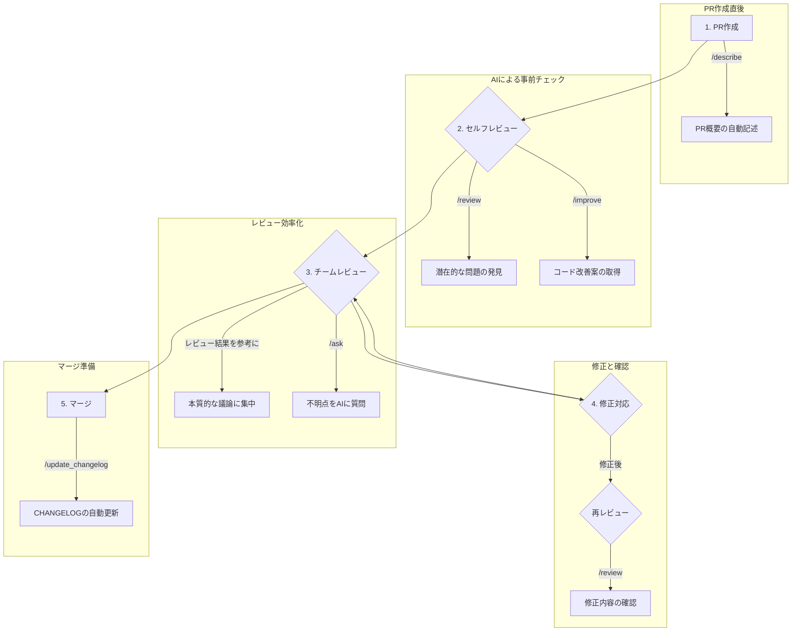

# 🔖PR-Agentインストールガイド

## 概要
PR-Agentは、AIを活用した自動コードレビューツールです。この手順書では、GitLabにPR-Agentを設定し、Merge Requestの自動分析・レビューを行う環境を構築する方法を説明します。

この記事は、以下のような方に向けて書かれています。
- GitLabでPR-Agentを導入したい方
- GitLabでAIコードレビューを導入したい方
- GitLabでAIコードレビューを導入したい方


## ⚠ 前提条件

### 必要なツールとアクセス権限
- Python 3.7以上がインストールされていること
- OpenAI APIキー（GPTを使用するため）
- GitLab Personal Access Token（APIアクセス用）
- GitLab上でWebhookを設定できる権限

### 必要なスコープ
GitLab Personal Access Tokenには以下のスコープが必要：
- `api`

## 📝 設定手順

### 1. PR-Agentリポジトリのクローンとインストール

```bash
# PR-Agentリポジトリをクローン
git clone https://github.com/Codium-ai/pr-agent.git
cd pr-agent

# パッケージをインストール
pip install -e .
```

### 2. 設定ファイルの準備

#### secrets設定ファイルの作成
```bash
# テンプレートファイルをコピー
cp pr_agent/settings/.secrets_template.toml pr_agent/settings/.secrets.toml
```

#### `.secrets.toml`ファイルの編集
```toml
[openai]
key = "your_openai_api_key_here"

[gitlab]
personal_access_token = "your_gitlab_personal_access_token"
shared_secret = "your_webhook_secret_token"
```

**設定項目の説明：**
- `openai.key`: OpenAI APIキー
- `gitlab.personal_access_token`: GitLab Personal Access Token
- `gitlab.shared_secret`: Webhook認証用の秘密トークン（任意の文字列）

1. personal_access_token  
personal_access_tokenはGitLabの「Preferences > Access Token」から取得できます。スコープapiにチェックを入れて作ってください。

2. shared_secret  
shared_secretは、以下の方法で生成することも可能です。

```bash
実行例：
python -c "import secrets; print(secrets.token_hex(10))"

出力例：
 8a9397ba4953ff9f447e
```
### 3. 設定ファイルのカスタマイズ

#### `configuration.toml`ファイルの編集
```toml
[config]
git_provider = "gitlab"

[pr_reviewer]
extra_instructions = "Please use Japanese in descriptions."

[pr_description]
publish_description = true
```

**主要な設定項目：**
- `git_provider`: "gitlab"に設定
- `pr_reviewer.extra_instructions`: レビューに関する追加指示
- `pr_description.publish_description`: 説明の自動生成を有効化


**レビュー観点の変更：**


PR-Agentを利用するプロジェクトの言語や、コーディングスタイル、コメントルールなどに合わせて、
レビュー観点を変更することができます。

例えば、以下のようにレビュー観点として設定することができます。

- 複数言語混在に対応したコードスタイル統一
- README.md 必須項目の自動チェック方針
- コメントの品質基準
- 推奨リンター・フォーマッタ設定
- PRレビュー時の必須チェック項目
- ベストプララクティスやセキュリティ標準の準拠など

```toml
[pr_reviewer]
extra_instructions = """
Please use Japanese in description.
言語ごとのベストプラクティス、セキュリティ基準、ドキュメント整備の観点からレビューしてください。
    
--- Python ---
- PEP8準拠、明確な命名、docstring整備（関数・クラスごとに用途と引数/戻り値を説明）
- 型ヒントの有無と一貫性
- 外部入力のバリデーションと例外処理
- SQLインジェクション等の脆弱性有無
- アルゴリズムやループのパフォーマンス
    
--- TypeScript ---
- tsconfigのstrictモード有効化（noImplicitAny, strictNullChecks）
- any型の排除、型推論の適切利用
- Promise/async処理のエラー捕捉
- AirbnbまたはGoogle Style準拠の命名・構造
- DOM操作やeval使用時のXSS対策
    
--- Go ---
- gofmt/goimports 適用
- エラー戻り値の必須チェック（if err != nil）
- Contextの適切な使用
- Effective Goに沿った命名とパッケージ構造
- govulncheck, gosec相当の脆弱性懸念箇所の指摘
    
--- README / ドキュメント ---
- READMEが最新の実装と一致しているか
- インストール手順、使用例、依存関係、ライセンスが明記されているか
- 新機能や変更点がドキュメント化されているか
- 図やコード例が正しく動作するか、古い情報が含まれていないか
    
--- コメント文 ---
- コードの意図や複雑な処理に十分なコメントがあるか
- コメントが最新コードと整合しているか（古い説明や不要なコメントは削除）
- コメントは簡潔かつ明確な表現で、チームのスタイルガイドに沿っているか
- TODOやFIXMEの内容が具体的で、不要なら解消または削除
    
--- 共通 ---
- セキュリティリスク（依存関係の既知脆弱性含む）の指摘
- コードの可読性と保守性向上の提案
- パフォーマンス改善余地の指摘
"""
```


### 4. Webhookサーバーの起動

```bash
# PR-AgentのWebhookサーバーを起動
python pr-agent/pr_agent/servers/gitlab_webhook.py
```

デフォルトでは、サーバーはポート3000で起動します。

> **参考** 
> ポート番号を変更する場合は、gitlab_webhook.pyに記載されている以下の行のport番号を変更してください。  
> uvicorn.run(app, host="0.0.0.0", port=3000)

### 5. GitLabでのWebhook設定

#### 5.1 プロジェクト設定画面にアクセス
1. GitLabのプロジェクトページにアクセス
2. 左サイドバーの「Settings」→「Webhooks」を選択

#### 5.2 Webhookの追加
以下の設定でWebhookを追加：

**URL:** `https://your-pr-agent-server-host/webhook`

> **注意** 
> URLは、ポート番号まで指定する必要があります。  
> 例. Gitlabと同一サーバ/ポート番号3000で動作している場合.  
>    http://127.0.0.1:3000/webhook


**Secret Token:** `.secrets.toml`で設定した`shared_secret`と同じ値

**Trigger Events:** 以下にチェック
- Comments
- Merge request events

#### 5.3 SSL verification
- Enable SSL verificationにチェック（httpsの場合）

#### 5.4 設定の保存
「Add webhook」ボタンをクリックして保存

### 6. デーモン化

#### `start_pr_agent.sh` に保存するファイル内容：
pr-agentのフォルダ皮下に以下のファイルを作成します。

```bash
#!/bin/bash
cd /path/to/pr-agent
source .venv/bin/activate
python pr_agent/servers/gitlab_webhook.py
```

#### `/etc/systemd/system/pr-agent.service`に保存するファイル内容：

```sample
 [Unit]
 Description=PR-Agent GitLab Webhook Server
 After=network.target

 [Service]
 Type=simple
 User=pr-agent
 Group=pr-agent
 WorkingDirectory=/path/to/pr-agent
 ExecStart=/path/to/pr-agent/start_pr_agent.sh
 Restart=always
 RestartSec=5
 StandardOutput=journal
 StandardError=journal

 [Install]
 WantedBy=multi-user.target
```

#### セットアップコマンド：
```bash
# サービスファイルを配置
sudo cp pr-agent.service /etc/systemd/system/

# systemdの設定を再読み込み
sudo systemctl daemon-reload

# サービスを有効化・起動
sudo systemctl enable pr-agent
sudo systemctl start pr-agent

# 状態確認
sudo systemctl status pr-agent
```


## ✍ 利用方法

このセクションでは、`pr-agent`の主要なコマンドと、それらを実際の開発ライフサイクルでどのように活用できるかを説明します。

### 主要コマンド一覧

| コマンド | 説明 |
|:---|:---|
| `/describe` | プルリクエストの変更内容を分析し、概要、PRの種類（機能追加、バグ修正など）、関連するファイルなどを自動で記述します。 |
| `/review` | コードをレビューし、品質、潜在的なバグ、セキュリティ上の懸念、改善点などを指摘します。セルフレビューにも、チームレビューの補助にも利用できます。 |
| `/improve` | コードをさらに改善するための具体的な提案（コードスニペット付き）を生成します。リファクタリングやパフォーマンス向上のヒントを得るのに役立ちます。 |
| `/ask` | プルリクエストのコードに関する質問をAIに投げかけることができます。例えば「この関数の役割は？」や「この変更による影響範囲は？」といった質問が可能です。 |
| `/update_changelog` | プルリクエストの内容に基づいて、`CHANGELOG.md` ファイルを自動で更新します。 |
| `/add_docs` | 変更されたコードに対して、ドキュメント（docstringなど）を自動で生成・追加します。 |
| `/test` | 変更されたコードに対するテストコードを自動で生成します。 |

### 開発ライフサイクルに合わせた利用シーン

`pr-agent` を開発フローに組み込むことで、各フェーズを効率化し、品質を向上させることができます。



**1. PR作成直後：概要の自動生成**
- プルリクエストを作成したら、まずコメントで **`/describe`** を実行します。
- AIがPRのタイトルや説明文、変更内容のウォークスルーを自動で生成してくれるため、レビュアーは変更の全体像を素早く把握できます。

**2. セルフレビュー：提出前の品質向上**
- チームにレビューを依頼する前に、セルフレビューとして **`/review`** を実行します。
- AIによる客観的な指摘（コーディング規約違反、潜在的なバグなど）を事前に修正することで、手戻りを減らし、レビューの質を高めます。
- さらに **`/improve`** を実行し、より良い実装のヒントを得て、コードをブラッシュアップします。

**3. チームレビュー：本質的な議論への集中**
- レビュアーは、まずAIによる `/review` の結果を確認します。これにより、機械的にチェックできる項目はAIに任せ、人間は設計思想や仕様の妥当性といった、より高度な議論に集中できます。
- コードの意図が不明な点があれば、**`/ask "このロジックの目的は何ですか？"`** のようにAIに質問し、理解を深めることができます。

**4. 修正対応：効率的な再レビュー**
- レビュアーからの指摘やAIの提案をもとにコードを修正します。
- 修正をプッシュした後、再度 **`/review`** を実行することで、修正が正しく行われたか、新たな問題が発生していないかを効率的に確認できます。

**5. マージ直前：ドキュメントとCHANGELOGの更新**
- レビューが完了し、マージの承認が得られたら、**`/update_changelog`** を実行します。
- PRの変更内容が `CHANGELOG.md` に自動で追記され、リリースノート作成の手間を省きます。

このように、開発の各段階で `pr-agent` のコマンドを適切に使い分けることで、開発プロセス全体の生産性とコード品質を大きく向上させることが可能です。

## 🚨トラブルシューティング

### よくある問題と解決方法

#### 1. Webhookが動作しない
- `.secrets.toml`の`shared_secret`とGitLabのSecret Tokenが一致しているか確認
- サーバーが正常に起動しているか確認（ポート3000）
- ngrok URLが正しくGitLabに設定されているか確認

#### 2. OpenAI APIエラー
- APIキーが正しく設定されているか確認
- OpenAI APIの利用制限に達していないか確認
- インターネット接続を確認

#### 3. GitLab認証エラー  
- Personal Access Tokenの権限スコープを確認
- トークンの有効期限を確認
- GitLabプロジェクトへのアクセス権限を確認

## 🔒 セキュリティ考慮事項

1. **認証情報の管理**
   - `.secrets.toml`ファイルは絶対にコミットしない
   - API키和トークンは定期的にローテーション

2. **ネットワークセキュリティ**
   - 本番環境では適切なファイアウォール設定を実施
   - HTTPS通信を使用

3. **アクセス制御**
   - 必要最小限の権限でPersonal Access Tokenを作成
   - Webhook URLは適切に保護


## 🔗 リンク
- [Github pr-agent](https://github.com/qodo-ai/pr-agent)
- [Qiita - GitLabにAIコードレビュー(PR-Agent)を導入する](https://qiita.com/ssc-yshikeda/items/5611780d1c46886a6526)

## まとめ

この手順書に従って設定することで、GitLabでAIによる自動コードレビューが利用できるようになります。チーム全体のコード品質向上と開発効率の向上が期待できます。

設定や運用で不明な点がある場合は、PR-Agentの公式ドキュメントや GitHub Issuesを参照してください。

## 🙏謝辞

この手順書は、@ssc-yshikedaが作成された手順を参考に作成しています。
公開下さりありがとうございます。
- [@ssc-yshikeda](https://qiita.com/ssc-yshikeda)

---

# 📑 Appendix.

## `configuration.toml` 設定項目一覧

このドキュメントは `configuration.toml` ファイルで設定可能な項目をまとめたものです。

### 目次

- [🔖PR-Agentインストールガイド](#pr-agentインストールガイド)
  - [概要](#概要)
  - [⚠ 前提条件](#-前提条件)
    - [必要なツールとアクセス権限](#必要なツールとアクセス権限)
    - [必要なスコープ](#必要なスコープ)
  - [📝 設定手順](#-設定手順)
    - [1. PR-Agentリポジトリのクローンとインストール](#1-pr-agentリポジトリのクローンとインストール)
    - [2. 設定ファイルの準備](#2-設定ファイルの準備)
      - [secrets設定ファイルの作成](#secrets設定ファイルの作成)
      - [`.secrets.toml`ファイルの編集](#secretstomlファイルの編集)
    - [3. 設定ファイルのカスタマイズ](#3-設定ファイルのカスタマイズ)
      - [`configuration.toml`ファイルの編集](#configurationtomlファイルの編集)
    - [4. Webhookサーバーの起動](#4-webhookサーバーの起動)
    - [5. GitLabでのWebhook設定](#5-gitlabでのwebhook設定)
      - [5.1 プロジェクト設定画面にアクセス](#51-プロジェクト設定画面にアクセス)
      - [5.2 Webhookの追加](#52-webhookの追加)
      - [5.3 SSL verification](#53-ssl-verification)
      - [5.4 設定の保存](#54-設定の保存)
    - [6. デーモン化](#6-デーモン化)
      - [`start_pr_agent.sh` に保存するファイル内容：](#start_pr_agentsh-に保存するファイル内容)
      - [`/etc/systemd/system/pr-agent.service`に保存するファイル内容：](#etcsystemdsystempr-agentserviceに保存するファイル内容)
      - [セットアップコマンド：](#セットアップコマンド)
  - [✍ 利用方法](#-利用方法)
    - [主要コマンド一覧](#主要コマンド一覧)
    - [開発ライフサイクルに合わせた利用シーン](#開発ライフサイクルに合わせた利用シーン)
  - [🚨トラブルシューティング](#トラブルシューティング)
    - [よくある問題と解決方法](#よくある問題と解決方法)
      - [1. Webhookが動作しない](#1-webhookが動作しない)
      - [2. OpenAI APIエラー](#2-openai-apiエラー)
      - [3. GitLab認証エラー](#3-gitlab認証エラー)
  - [🔒 セキュリティ考慮事項](#-セキュリティ考慮事項)
  - [🔗 リンク](#-リンク)
  - [まとめ](#まとめ)
  - [🙏謝辞](#謝辞)
- [📑 Appendix.](#-appendix)
  - [`configuration.toml` 設定項目一覧](#configurationtoml-設定項目一覧)
    - [目次](#目次)
  - [全般設定 (`[config]`)](#全般設定-config)
  - [レビュー (`[pr_reviewer]`)](#レビュー-pr_reviewer)
  - [説明文生成 (`[pr_description]`)](#説明文生成-pr_description)
  - [質問 (`[pr_questions]`)](#質問-pr_questions)
  - [コード提案 (`[pr_code_suggestions]`)](#コード提案-pr_code_suggestions)
  - [カスタムプロンプト (`[pr_custom_prompt]`)](#カスタムプロンプト-pr_custom_prompt)
  - [ドキュメント追記 (`[pr_add_docs]`)](#ドキュメント追記-pr_add_docs)
  - [CHANGELOG更新 (`[pr_update_changelog]`)](#changelog更新-pr_update_changelog)
  - [分析 (`[pr_analyze]`)](#分析-pr_analyze)
  - [テスト生成 (`[pr_test]`)](#テスト生成-pr_test)
  - [コンポーネント改善 (`[pr_improve_component]`)](#コンポーネント改善-pr_improve_component)
  - [チェック (`[checks]`)](#チェック-checks)
  - [ヘルプ (`[pr_help]`)](#ヘルプ-pr_help)
  - [設定 (`[pr_config]`)](#設定-pr_config)
  - [ヘルプドキュメント (`[pr_help_docs]`)](#ヘルプドキュメント-pr_help_docs)
  - [Git プロバイダ設定](#git-プロバイダ設定)
    - [GitHub (`[github]`)](#github-github)
    - [GitHub Action (`[github_action_config]`)](#github-action-github_action_config)
    - [GitHub App (`[github_app]`)](#github-app-github_app)
    - [GitLab (`[gitlab]`)](#gitlab-gitlab)
    - [Gitea (`[gitea_app]`)](#gitea-gitea_app)
    - [Bitbucket (`[bitbucket_app]`)](#bitbucket-bitbucket_app)
    - [Local (`[local]`)](#local-local)
    - [Gerrit (`[gerrit]`)](#gerrit-gerrit)
    - [Bitbucket Server (`[bitbucket_server]`)](#bitbucket-server-bitbucket_server)
    - [Azure DevOps Server (`[azure_devops_server]`)](#azure-devops-server-azure_devops_server)
  - [その他サービス連携](#その他サービス連携)
    - [LiteLLM (`[litellm]`)](#litellm-litellm)
    - [類似Issue検索 (`[pr_similar_issue]`)](#類似issue検索-pr_similar_issue)
    - [類似コンポーネント検索 (`[pr_find_similar_component]`)](#類似コンポーネント検索-pr_find_similar_component)
    - [Pinecone (`[pinecone]`)](#pinecone-pinecone)
    - [LanceDB (`[lancedb]`)](#lancedb-lancedb)
  - [ベストプラクティス](#ベストプラクティス)
    - [`[best_practices]`](#best_practices)
    - [`[auto_best_practices]`](#auto_best_practices)
  - [レビュー品質を向上させるための設定 (`configuration.toml`)](#レビュー品質を向上させるための設定-configurationtoml)
    - [1. レビューの観点を具体的に指示する (`extra_instructions`)](#1-レビューの観点を具体的に指示する-extra_instructions)
    - [2. レビューの必須項目を調整する](#2-レビューの必須項目を調整する)
    - [3. コード提案の品質を調整する (`suggestions_score_threshold`)](#3-コード提案の品質を調整する-suggestions_score_threshold)
    - [4. AIモデルの選択 (`model`)](#4-aiモデルの選択-model)
    - [5. 指摘事項の最大数を調整する (`num_max_findings`)](#5-指摘事項の最大数を調整する-num_max_findings)
  - [`configuration.toml`以外のファイルでの品質向上](#configurationtoml以外のファイルでの品質向上)
    - [1. レビュープロンプトのカスタマイズ (`pr_reviewer_prompts.toml`)](#1-レビュープロンプトのカスタマイズ-pr_reviewer_promptstoml)
    - [2. カスタムラベルの定義 (`custom_labels.toml`)](#2-カスタムラベルの定義-custom_labelstoml)
    - [3. 無視リストの活用 (`ignore.toml`)](#3-無視リストの活用-ignoretoml)
    - [4. Issueの内容に基づいたレビューを行う](#4-issueの内容に基づいたレビューを行う)
      - [さらなる品質向上のために](#さらなる品質向上のために)
---

## 全般設定 (`[config]`)

| キー | 説明 | デフォルト値 |
|:---|:---|:---|
| `model` | 使用するメインのAIモデル。 | `"gpt-5-2025-08-07"` |
| `fallback_models` | メインモデルが失敗した場合に使用するフォールバックモデルのリスト。 | `["o4-mini"]` |
| `git_provider` | 使用するGitプロバイダ ("github", "gitlab"など)。 | `"gitlab"` |
| `publish_output` | 出力を公開するかどうか。 | `true` |
| `publish_output_progress` | 処理の進捗状況を公開するかどうか。 | `true` |
| `verbosity_level` | 出力の詳細レベル (0, 1, 2)。 | `0` |
| `log_level` | ログレベル ("DEBUG", "INFO"など)。 | `"DEBUG"` |
| `use_wiki_settings_file` | Wikiの設定ファイルを使用するかどうか。 | `true` |
| `use_repo_settings_file` | リポジトリの設定ファイルを使用するかどうか。 | `true` |
| `use_global_settings_file` | グローバルの設定ファイルを使用するかどうか。 | `true` |
| `disable_auto_feedback` | 自動フィードバックを無効にするか。 | `false` |
| `ai_timeout` | AIの応答タイムアウト時間 (秒)。 | `120` |
| `response_language` | PRへの応答言語 (例: "ja-JP", "en-US")。 | `"ja-JP"` |
| `max_description_tokens` | 説明文に使用する最大トークン数。 | `500` |
| `max_commits_tokens` | コミットメッセージに使用する最大トークン数。 | `500` |
| `max_model_tokens` | モデルが使用できる最大トークン数。 | `32000` |
| `temperature` | モデルの出力の多様性を制御する値。 | `0.2` |
| `ignore_pr_title` | PRタイトルに基づいてPR-Agentを無視する正規表現のリスト。 | `["^\[Auto\]", "^Auto"]` |

## レビュー (`[pr_reviewer]`)

`/review` コマンドの設定です。

| キー | 説明 | デフォルト値 |
|:---|:---|:---|
| `require_score_review` | スコアレビューを必須にするか。 | `false` |
| `require_tests_review` | テストのレビューを必須にするか。 | `true` |
| `require_estimate_effort_to_review` | レビュー工数の見積もりを必須にするか。 | `true` |
| `require_security_review` | セキュリティレビューを必須にするか。 | `true` |
| `persistent_comment` | コメントを永続化するか。 | `true` |
| `extra_instructions` | レビュー時に追加する指示。日本語での説明や言語ごとのチェック項目が設定されています。 | (長文のため省略) |
| `num_max_findings` | 最大指摘事項数。 | `3` |

## 説明文生成 (`[pr_description]`)

`/describe` コマンドの設定です。

| キー | 説明 | デフォルト値 |
|:---|:---|:---|
| `publish_labels` | ラベルを公開するか。 | `false` |
| `add_original_user_description` | 元のユーザー説明を追加するか。 | `true` |
| `generate_ai_title` | AIにタイトルを生成させるか。 | `false` |
| `use_bullet_points` | 箇条書きを使用するか。 | `true` |
| `extra_instructions` | 説明文生成時の追加指示。 | `"Please use Japanese in description"` |
| `enable_pr_type` | PRのタイプを有効にするか。 | `true` |
| `enable_pr_diagram` | PRの変更内容の図を追加するか。 | `true` |

## 質問 (`[pr_questions]`)

`/ask` コマンドの設定です。

| キー | 説明 | デフォルト値 |
|:---|:---|:---|
| `use_conversation_history` | 会話履歴を使用するか。 | `true` |

## コード提案 (`[pr_code_suggestions]`)

`/improve` コマンドの設定です。

| キー | 説明 | デフォルト値 |
|:---|:---|:---|
| `commitable_code_suggestions` | コミット可能なコード提案を行うか。 | `false` |
| `focus_only_on_problems` | 問題点のみに焦点を当てるか。 | `true` |
| `extra_instructions` | コード提案時の追加指示。 | `"Please use Japanese in description"` |
| `persistent_comment` | コメントを永続化するか。 | `true` |
| `suggestions_score_threshold` | 提案を表示するスコアの閾値 (0-10)。 | `0` |

## カスタムプロンプト (`[pr_custom_prompt]`)

`/custom_prompt` コマンドの設定です。

| キー | 説明 |
|:---|:---|
| `prompt` | コード提案の焦点を指定するカスタムプロンプト。 |
| `suggestions_score_threshold` | 提案を表示するスコアの閾値 (0-10)。 |
| `num_code_suggestions_per_chunk` | チャンクごとのコード提案数。 |
| `self_reflect_on_custom_suggestions` | カスタム提案に対して自己反省を行うか。 |

## ドキュメント追記 (`[pr_add_docs]`)

`/add_docs` コマンドの設定です。

| キー | 説明 | デフォルト値 |
|:---|:---|:---|
| `docs_style` | ドキュメントのスタイル。 | `"Sphinx"` |

## CHANGELOG更新 (`[pr_update_changelog]`)

`/update_changelog` コマンドの設定です。

| キー | 説明 | デフォルト値 |
|:---|:---|:---|
| `push_changelog_changes` | CHANGELOGの変更をプッシュするか。 | `false` |
| `add_pr_link` | CHANGELOGにPRへのリンクを追加するか。 | `true` |

## 分析 (`[pr_analyze]`)

`/analyze` コマンドの設定です。

| キー | 説明 | デフォルト値 |
|:---|:---|:---|
| `enable_help_text` | ヘルプテキストを有効にするか。 | `true` |

## テスト生成 (`[pr_test]`)

`/test` コマンドの設定です。

| キー | 説明 | デフォルト値 |
|:---|:---|:---|
| `num_tests` | 生成するテストの数。 | `3` |
| `avoid_mocks` | モックではなく実オブジェクトの使用を優先するか。 | `true` |

## コンポーネント改善 (`[pr_improve_component]`)

`/improve_component` コマンドの設定です。

| キー | 説明 | デフォルト値 |
|:---|:---|:---|
| `num_code_suggestions` | コード提案の数。 | `4` |

## チェック (`[checks]`)

`/checks` コマンドの設定です (Pro機能)。

| キー | 説明 | デフォルト値 |
|:---|:---|:---|
| `enable_auto_checks_feedback` | 自動チェックフィードバックを有効にするか。 | `true` |
| `excluded_checks_list` | 除外するチェックのリスト。 | `["lint"]` |

## ヘルプ (`[pr_help]`)

`/help` コマンドの設定です。

| キー | 説明 | デフォルト値 |
|:---|:---|:---|
| `num_retrieved_snippets` | 取得するスニペットの数。 | `5` |

## 設定 (`[pr_config]`)

`/config` コマンドの設定です。特に設定項目はありません。

## ヘルプドキュメント (`[pr_help_docs]`)

| キー | 説明 | デフォルト値 |
|:---|:---|:---|
| `repo_default_branch` | リポジトリのデフォルトブランチ。 | `"main"` |
| `docs_path` | ドキュメントのパス。 | `"docs"` |
| `supported_doc_exts` | サポートするドキュメントの拡張子。 | `[".md", ".mdx", ".rst"]` |

## Git プロバイダ設定

### GitHub (`[github]`)

| キー | 説明 | デフォルト値 |
|:---|:---|:---|
| `deployment_type` | デプロイメントタイプ ('app' or 'user')。 | `"user"` |
| `base_url` | GitHub APIのベースURL。 | `"https://api.github.com"` |
| `app_name` | アプリケーション名。 | `"pr-agent"` |

### GitHub Action (`[github_action_config]`)

GitHub Actionsのワークフローで環境変数として設定される項目です。

### GitHub App (`[github_app]`)

| キー | 説明 |
|:---|:---|
| `handle_pr_actions` | 反応するPRのアクションリスト。 |
| `pr_commands` | PRイベントで実行するコマンドリスト。 |
| `handle_push_trigger` | pushをトリガーとして処理を行うか。 |
| `push_commands` | pushイベントで実行するコマンドリスト。 |

### GitLab (`[gitlab]`)

| キー | 説明 |
|:---|:---|
| `url` | GitLabのURL。 |
| `pr_commands` | MRイベントで実行するコマンドリスト。 |
| `handle_push_trigger` | pushをトリガーとして処理を行うか。 |
| `push_commands` | pushイベントで実行するコマンドリスト。 |

### Gitea (`[gitea_app]`)

### Bitbucket (`[bitbucket_app]`)

### Local (`[local]`)

### Gerrit (`[gerrit]`)

### Bitbucket Server (`[bitbucket_server]`)

### Azure DevOps Server (`[azure_devops_server]`)

上記プロバイダも同様に、実行するコマンドなどを設定します。

## その他サービス連携

### LiteLLM (`[litellm]`)

### 類似Issue検索 (`[pr_similar_issue]`)

| キー | 説明 | デフォルト値 |
|:---|:---|:---|
| `max_issues_to_scan` | スキャンする最大Issue数。 | `500` |
| `vectordb` | 使用するベクトルデータベース。 | `"pinecone"` |

### 類似コンポーネント検索 (`[pr_find_similar_component]`)

### Pinecone (`[pinecone]`)

APIキーなどの認証情報は `.secrets.toml` に記載します。

### LanceDB (`[lancedb]`)

| キー | 説明 | デフォルト値 |
|:---|:---|:---|
| `uri` | LanceDBのURI。 | `"./lancedb"` |

## ベストプラクティス

### `[best_practices]`

組織独自のベストプラクティスを定義します。

### `[auto_best_practices]`

| キー | 説明 | デフォルト値 |
|:---|:---|:---|
| `enable_auto_best_practices` | 自動ベストプラクティス機能を有効にするか。 | `true` |
| `utilize_auto_best_practices` | `/improve` ツールで自動ベストプラクティスを利用するか。 | `true` |
| `max_patterns` | 検出するパターンの最大数。 | `5` |

---

## レビュー品質を向上させるための設定 (`configuration.toml`)

`pr-agent` のレビュー品質を向上させるために一般的に変更される設定項目と、その凡例を以下に示します。

レビュー品質の向上は、主に以下の2つのアプローチで行われます。

1.  **AIへの指示を具体化し、レビューの観点を明確にする**
2.  **レビューの必須項目を増やし、網羅性を高める**

これらを実現するために、特に重要ないくつかの設定項目を以下に示します。

### 1. レビューの観点を具体的に指示する (`extra_instructions`)

**設定項目:** `[pr_reviewer].extra_instructions`

**目的:**
AIレビュアーに対して、どのような観点でレビューを行ってほしいかを具体的に指示します。プロジェクトのコーディング規約、重視している品質特性（例: パフォーマンス、セキュリティ、保守性）、あるいは特定の技術スタックで注意すべき点などを詳細に記述することで、より的確で質の高いレビューが期待できます。これはレビュー品質を向上させる上で最も効果的な項目の一つです。

**設定凡例:**
```toml
[pr_reviewer]
extra_instructions = """
# 全体的なレビュー方針
- **日本語で**、丁寧かつ建設的なフィードバックを心がけてください。
- 変更の意図が明確に伝わるかを重視してください。
- セキュリティ上の脆弱性（SQLインジェクション、XSSなど）がないか、特に注意深く確認してください。

# 技術スタックごとの規約
--- Python ---
- PEP8に準拠しているか。
- 型ヒントが適切に使用されているか。
- エラーハンドリングは網羅的か。

--- React/TypeScript ---
- `any`型を使用せず、具体的な型定義がされているか。
- コンポーネントの責務が単一になっているか。
- 再利用性の低いコードは共通化を検討してください。

# その他
- 不要なコメントや`console.log`が残っていないか確認してください。
- ドキュメント（README.mdなど）の更新が必要な変更であれば、その旨を指摘してください。
"""
```
**解説:**
この例では、全体的な方針に加え、技術スタックごとに具体的なチェック項目を設けています。これにより、AIは漠然とコードをレビューするのではなく、定義された規約や観点に基づいて、より深く鋭い指摘を行えるようになります。

### 2. レビューの必須項目を調整する

**目的:**
プロジェクトで重要視するレビュー項目を必須化することで、レビューの抜け漏れを防ぎ、品質のベースラインを確保します。

**設定凡例:**
| 設定項目 | 目的 | 設定例 |
|:---|:---|:---|
| `[pr_reviewer].require_score_review` | 1-5段階でのスコアリングを必須化し、PRの品質を定量的に評価します。 | `true` |
| `[pr_reviewer].require_tests_review` | PRにテストコードが含まれているか、または既存のテストに影響がないかをAIにチェックさせます。 | `true` |
| `[pr_reviewer].require_security_review` | セキュリティ観点でのレビューを必須化します。特に外部入力や認証を扱うリポジトリで重要です。 | `true` |

**解説:**
例えば、品質を厳格に管理したいリポジトリでは、これらをすべて `true` に設定します。一方で、小規模な修正やドキュメントの変更が多いリポジトリでは、`require_tests_review` を `false` にして柔軟性を高めるなど、プロジェクトの特性に合わせて調整します。

### 3. コード提案の品質を調整する (`suggestions_score_threshold`)

**設定項目:** `[pr_code_suggestions].suggestions_score_threshold`

**目的:**
AIが生成するコード提案のうち、どの程度確信度が高いものを表示するかを制御します。閾値を上げることで、ノイズの少ない、より質の高い提案に絞ることができます。

**設定凡例:**
```toml
[pr_code_suggestions]
# 確信度が7以上の、質の高い提案のみを表示する
suggestions_score_threshold = 7
```
**解説:**
デフォルトは `0` で全ての提案を表示しますが、提案が多すぎてノイズに感じる場合は `5` や `7` のような値に設定することで、開発者は本当に価値のある提案に集中できます。どの値が最適かはプロジェクトやチームの好みによるため、調整しながら最適な値を見つけるのが良いでしょう。

### 4. AIモデルの選択 (`model`)

**設定項目:** `[config].model`

**目的:**
レビューや各種タスクに使用するAIモデルを選択します。より高性能なモデルを指定することで、一般的にレビューの精度やコード理解の深度が向上します。

**設定凡例:**
```toml
[config]
# より高性能な最新モデルを指定する
model = "gpt-4-turbo" 
# あるいは、特定のタスクに特化したモデルがあればそれを指定
```
**解説:**
モデルの性能はレビュー品質に直結します。コストとのトレードオフになりますが、品質を最優先する場合は、利用可能な範囲で最も高性能なモデルを選択することが推奨されます。

### 5. 指摘事項の最大数を調整する (`num_max_findings`)

**設定項目:** `[pr_reviewer].num_max_findings`

**目的:**
一度のレビューでAIが報告する指摘事項の最大数を設定します。この値を調整することで、レビューの粒度をコントロールできます。

**設定凡例:**
```toml
[pr_reviewer]
# 指摘事項の最大数を10件に増やす
num_max_findings = 10
```
**解説:**
デフォルトは `3` です。より多くのフィードバックを得たい場合はこの数値を増やします。明確な上限値は定義されていませんが、`50`や`100`のような大きな値を設定すると、AIが検出した指摘を可能な限り多く出力させることができます。ただし、ノイズの増加、コストの増加、パフォーマンスの低下につながる可能性があるため、`10`や`15`あたりから試すのが現実的です。

---

## `configuration.toml`以外のファイルでの品質向上

`configuration.toml`以外にも、レビュー品質の向上に大きく寄与する設定ファイルがいくつか存在します。

主に、**AIへの指示そのもの（プロンプト）を定義するファイル**や、**レビューの範囲を制御するファイル**を調整することで、よりプロジェクトに特化した、質の高いレビューが実現できます。

特に重要なファイルを3つご紹介します。

### 1. レビュープロンプトのカスタマイズ (`pr_reviewer_prompts.toml`)

**目的:**
このファイルは `/review` コマンドが使用するAIへのプロンプトそのものを定義しています。`configuration.toml` の `extra_instructions` は既存のプロンプトに追加する指示でしたが、このファイルを直接編集することで、AIの思考プロセスや出力形式の根幹からカスタマイズできます。これにより、プロジェクトが求めるレビューの形式や観点を、より強力に反映させることが可能です。

**設定凡例:**
`pr_reviewer_prompts.toml` の中には、例えば `review_pr_prompt` というキーでメインのプロンプトが定義されています。

```toml
# pr_reviewer_prompts.toml の一部（イメージ）
[pr_reviewer_prompts]
review_pr_prompt="""
プルリクエストのレビューを行ってください。
変更点を分析し、以下の観点から具体的なフィードバックを提供してください。

1.  **コードの品質**:
    - 可読性、保守性は高いか？
    - {language} のベストプラクティスに従っているか？
    - より効率的な実装方法はないか？

2.  **潜在的なバグ**:
    - エッジケースは考慮されているか？
    - リソースリークの可能性はないか？

3.  **セキュリティ**:
    - 脆弱性に繋がるコードはないか？

フィードバックは、必ずしもコードの修正を求めるものだけでなく、肯定的な点や、将来的な改善提案も含めてください。
"""
```
**解説:**
このプロンプト内の文言を調整します。例えば、「**特にパフォーマンスを重視してレビューしてください**」といった一文を加えたり、プロジェクト独自のルール「**○○という命名規則に従っているか確認してください**」といった具体的な指示を盛り込むことで、AIのレビューの視点を誘導し、品質を向上させることができます。

### 2. カスタムラベルの定義 (`custom_labels.toml`)

**目的:**
`/describe` コマンドなどでAIがPRを分析した結果、自動的に付与するラベルをカスタマイズします。デフォルトのラベル（例: `Bug fix`, `Enhancement`）がプロジェクトのワークフローに合わない場合に、独自のラベルを定義することで、PRの性質が一目でわかるようになります。これにより、レビュアーがPRの背景を理解しやすくなり、レビュープロセス全体の効率と品質が向上します。

**設定凡例:**
```toml
# custom_labels.toml
[pr_custom_labels]
labels = [
    "緊急リリース",
    "リファクタリング",
    "機能追加",
    "バグ修正",
    "ドキュメント",
    "テストコード",
    "その他"
]

# ラベルの説明 (任意)
description_Bug_fix = "バグ修正に関する変更"
description_Refactoring = "コードの可読性や構造を改善するリファクタリング"
```
**解説:**
プロジェクトで管理しているラベル（例: `Hotfix`, `Feature`, `Chore`）に合わせてこのファイルを変更することで、`pr-agent`の運用を既存のワークフローにスムーズに統合できます。

### 3. 無視リストの活用 (`ignore.toml`)

**目的:**
自動生成されたファイル、テスト用のデータ、ドキュメントなど、AIによるレビューが不要なファイルを指定します。レビュー対象からこれらを除外することで、AIは本当にレビューが必要なコアロジックに集中できます。これにより、ノイズが減り、重要なコードに対するレビューの質が向上します。

**設定凡例:**
```toml
# ignore.toml
[ignore]
# ファイルパスのパターン (glob形式)
patterns = [
    "**/__snapshots__/*",
    "*.lock",
    "dist/*",
    "docs/**/*.md"
]
```
**解説:**
`package-lock.json` のようなロックファイルや、ビルドによって生成される `dist` ディレクトリなどを指定します。これにより、不要なレビューコメントを防ぎ、レビュアーが確認すべき指摘事項を明確にすることができます。

### 4. Issueの内容に基づいたレビューを行う

この設定が有効になっていると、`/review` コマンドを実行した際に、`pr-agent`は以下のステップでレビューを行います。

1.  **Issue情報の取得:** PRにリンクされているIssueのタイトル、本文、コメントなどを自動で取得します。
2.  **レビューコンテキストへの追加:** 取得したIssueの情報を、コードレビューを行う際のAIへのプロンプト（コンテキスト）に含めます。
3.  **目的指向のレビュー:** AIはコードの変更点だけでなく、「**このPRが解決しようとしている課題（Issue）は何か**」を理解した上で、以下のような多角的なレビューを実施します。
    *   **要求仕様との整合性:** 「この機能追加PRは、Issueに書かれた要求仕様をすべて満たしているか？」
    *   **バグ修正の妥当性:** 「このバグ修正PRは、報告されている問題の根本原因を解決できているか？別のデグレを引き起こさないか？」
    *   **考慮漏れの指摘:** 「Issueで言及されているエッジケースや制約事項が、コードに正しく反映されているか？」

#### さらなる品質向上のために

この機能をさらに効果的に活用するために、`extra_instructions` と組み合わせることも有効です。

```toml
# configuration.toml

[pr_reviewer]
require_ticket_analysis_review = true
extra_instructions = """
# レビュー方針
- **最優先事項として、このPRに紐付くIssueの内容を深く理解し、その要求が完全に満たされているかを確認してください。**
- Issueの要求仕様と実装に乖離がある場合は、具体的に指摘してください。
- ...
"""
```

このように設定することで、`pr-agent`は単なるコードチェッカーではなく、**プロジェクトの要求仕様を理解したビジネスアナリスト**のような視点も持ってレビューを行ってくれるようになり、手戻りの少ない、より質の高い開発サイクルを実現できます。

---

これらのファイルを調整することで、`pr-agent`を単なる汎用ツールから、**プロジェクト専属の優秀なアシスタント**へと育てていくことが可能です。