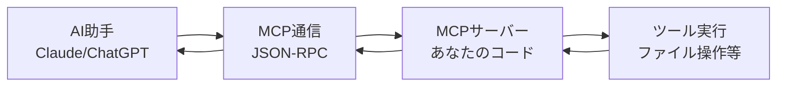

# チュートリアル1: 基本概念 🎓

**所要時間: 15分**  
**前提知識: Python基礎**

## 📚 MCP（Model Context Protocol）とは？

MCPは、AI助手（Claude、ChatGPT等）が外部ツールを使えるようにする**通信規格**です。

### 🔄 従来の問題
```
AI助手 → 「ファイルを読んでください」
あなた → コピペでファイル内容を送信 😓
AI助手 → 「計算をしてください」  
あなた → 電卓で計算してコピペ 😓
```

### ✨ MCPで解決
```
AI助手 → MCPサーバー → ファイル読み込み → 結果を返す ✨
AI助手 → MCPサーバー → 計算実行 → 結果を返す ✨
```

**つまり、AI助手があなたの代わりに作業をしてくれる！**

## 🚀 FastMCPとは？

FastMCPは、MCPサーバーを**最も簡単に**作れるPythonライブラリです。

### 他のMCPライブラリとの比較

| 特徴 | FastMCP | Python MCP SDK | Node.js MCP |
|------|---------|----------------|-------------|
| 学習難易度 | ⭐ 易しい | ⭐⭐ 普通 | ⭐⭐⭐ 難しい |
| コード量 | 📝 少ない | 📝📝 普通 | 📝📝📝 多い |
| 起動速度 | ⚡ 高速 | ⚡ 普通 | ⚡ 普通 |
| 学習時間 | 🕐 30分 | 🕐 2時間 | 🕐 4時間 |

## 💡 具体例：Hello World

### 従来のPython MCP SDK
```python
# 20行以上のコード
import logging
from mcp.server.models import InitializationOptions
from mcp.server import NotificationOptions, Server
from mcp.types import (
    CallToolRequest, CallToolResult, ListToolsRequest, Tool,
    TextContent, ImageContent, EmbeddedResource, LoggingLevel
)

server = Server("hello-world")

@server.list_tools()
async def handle_list_tools() -> list[Tool]:
    return [
        Tool(
            name="say_hello",
            description="Say hello to someone",
            inputSchema={
                "type": "object",
                "properties": {
                    "name": {"type": "string", "description": "Name to greet"}
                },
                "required": ["name"]
            }
        )
    ]

@server.call_tool()
async def handle_call_tool(request: CallToolRequest) -> CallToolResult:
    # さらに複雑な実装...
```

### 🎉 FastMCP
```python
# たった5行！
from fastmcp import FastMCP

app = FastMCP("Hello World")

@app.tool
def say_hello(name: str) -> str:
    """Say hello to someone"""
    return f"Hello, {name}!"
```

**90%コードが減りました！**

## 🏗️ MCPの仕組み



### 通信方式
MCPは2つの通信方式をサポート：

1. **STDIO** - 標準入出力（Claude Desktop等）
2. **SSE** - Server-Sent Events（Web経由）

FastMCPスターターキットは**両方自動対応**！

## 🔧 実際に動かしてみよう

### 1. 最小サンプル作成
```python
# hello.py
from fastmcp import FastMCP

app = FastMCP("My First MCP")

@app.tool
def greet(name: str) -> str:
    """挨拶をする"""
    return f"こんにちは、{name}さん！"

@app.tool
def add_numbers(a: int, b: int) -> int:
    """2つの数を足し算する"""
    return a + b

if __name__ == "__main__":
    app.run()
```

### 2. 実行
```bash
# STDIOモードで実行
python hello.py

# SSEモードで実行
python hello.py --transport sse --port 8000
```

### 3. テスト
STDIOモードでは標準入力にMCPメッセージを送信：
```json
{"jsonrpc": "2.0", "id": 1, "method": "tools/list"}
```

SSEモードではブラウザで `http://localhost:8000` にアクセス

## 📋 ツールの定義方法

### 基本的なツール
```python
@app.tool
def simple_tool(param: str) -> str:
    """ツールの説明"""
    return f"処理結果: {param}"
```

### 複数パラメータ
```python
@app.tool
def complex_tool(name: str, age: int, active: bool = True) -> dict:
    """複雑なツールの例"""
    return {
        "name": name,
        "age": age,
        "status": "active" if active else "inactive"
    }
```

### エラーハンドリング
```python
@app.tool
def safe_divide(a: float, b: float) -> float:
    """安全な除算"""
    if b == 0:
        raise ValueError("ゼロで割ることはできません")
    return a / b
```

## 🎯 主要概念まとめ

| 概念 | 説明 | 例 |
|------|------|-----|
| **MCPサーバー** | ツールを提供するプログラム | `FastMCP("サーバー名")` |
| **ツール** | AI助手が使える機能 | `@app.tool` |
| **Transport** | 通信方式 | STDIO / SSE |
| **パラメータ** | ツールの入力 | `name: str` |
| **戻り値** | ツールの出力 | `return "結果"` |

## ✅ 理解度チェック

以下の質問に答えられますか？

1. MCPの目的は何ですか？
2. FastMCPの利点を3つ挙げてください
3. STDIOとSSEの違いは何ですか？
4. `@app.tool` デコレータの役割は？

<details>
<summary>解答例</summary>

1. AI助手が外部ツールを自動で使えるようにすること
2. コードが短い、学習が簡単、起動が高速
3. STDIO=標準入出力、SSE=Web経由の通信
4. 関数をMCPツールとして登録すること

</details>

## 🔄 次のステップ

基本概念を理解できたら、次は実際にツールを作ってみましょう！

**[→ チュートリアル2: Hello World](02-hello-world.md)**

---

💡 **困った時は**: [トラブルシューティング](../troubleshooting.md) をご確認ください。 